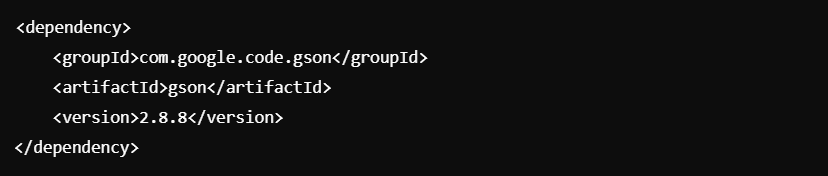
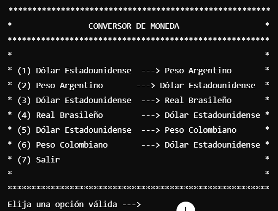
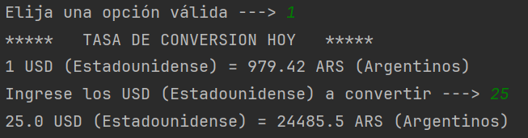

# Conversor de Monedas

Este proyecto es una aplicación en Java que permite convertir monedas entre varios tipos (USD, ARS, BRL, COP, etc.) utilizando una API de tasas de cambio. La aplicación se ejecuta en la terminal e interactúa con el usuario para ingresar la cantidad a convertir y mostrar la tasa de conversión actual.

## Requisitos

- **Java 11 o superior**
- **Dependencias:**
    - `Gson` para el manejo de JSON
    - `HttpClient` para realizar solicitudes HTTP (nativo de Java 11)

## Instalación

1. Clonar este repositorio:
   https://github.com/LitoLitoLito/ConversorDeMoneda.git
2. Asegúrate de tener Java 11 o superior instalado en tu sistema.
3. Si estás usando un IDE como IntelliJ o Eclipse, importa el proyecto como un proyecto de Java.
4. Agrega la dependencia de Gson en tu entorno: 
Si estás usando Maven, agrega lo siguiente en el archivo pom.xml:

Si no estás usando Maven, puedes descargar la librería desde Gson e incluirla manualmente.

## Configuración de la API
Este proyecto utiliza la API de ExchangeRate-API para obtener las tasas de conversión. Debes registrarte en https://www.exchangerate-api.com/ para obtener una clave de API y reemplazarla en la URL dentro del código.

1. En la clase ConsultarMoneda, reemplaza la clave API por la tuya:
URI direccion = URI.create("https://v6.exchangerate-api.com/v6/TU_CLAVE_DE_API/pair/" + monedaBase + "/" + monedaObjetivo);
## Uso
1. Ejecuta el proyecto desde tu IDE o terminal.
2. El programa mostrará un menú con las opciones de conversión de moneda:

3. Elige la opción correspondiente para realizar la conversión. 
El programa te mostrará la tasa de conversión actual.
4. Luego, ingresa la cantidad de dinero que deseas convertir.
5. Te mostrará lo algo como esto:
   

## Explicación del código
### Clase App
Esta es la clase principal que inicia el programa y gestiona la interacción con el usuario mediante un menú de opciones. Utiliza la clase ConsultarMoneda para obtener la tasa de conversión y la clase ConvertirMoneda para realizar la conversión.

### Clase ConsultarMoneda
Esta clase se encarga de realizar la solicitud a la API de Exchange Rate, construyendo la URL con las monedas base y objetivo, y devolviendo la tasa de conversión obtenida en formato JSON.

### Clase ConvertirMoneda
Aquí es donde se realiza el cálculo de la conversión. Solicita al usuario la cantidad a convertir, valida la entrada, y realiza el cálculo usando la tasa de conversión proporcionada por ConsultarMoneda.

