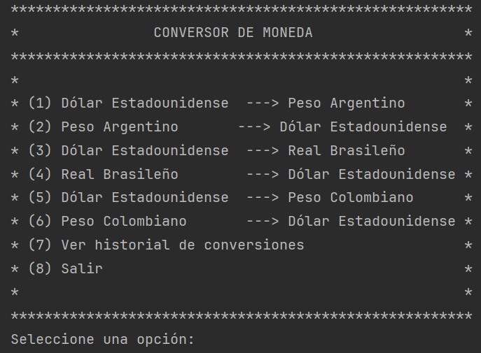
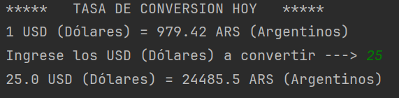
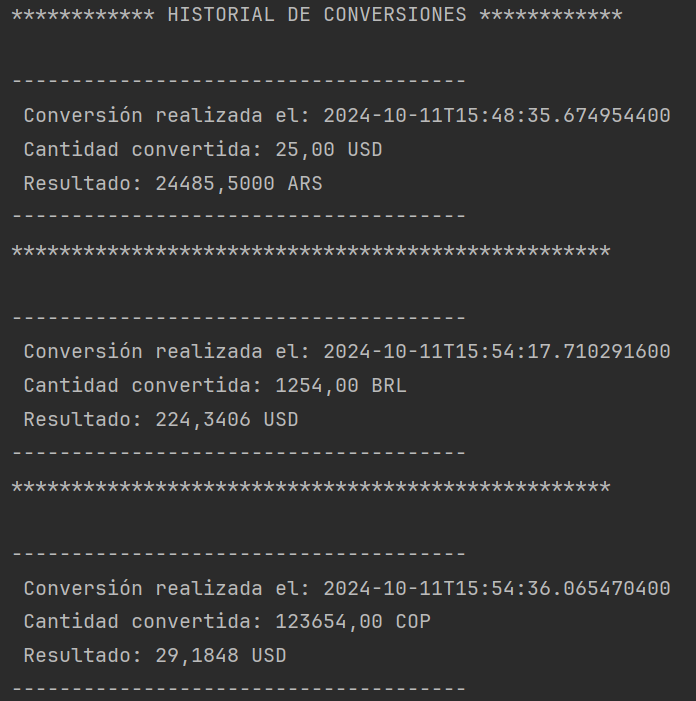

# Conversor de Monedas
Este proyecto es una aplicación en Java que permite convertir monedas entre varios tipos (USD, ARS, BRL, COP, etc.) utilizando una API de tasas de cambio. La aplicación se ejecuta en la terminal e interactúa con el usuario para ingresar la cantidad a convertir y mostrar la tasa de conversión actual.

## Requisitos
- **Java 11 o superior**
- **Dependencias:**
    - `Gson` para el manejo de JSON
    - `HttpClient` para realizar solicitudes HTTP (nativo de Java 11)

## Instalación
1. Clonar este repositorio: [https://github.com/LitoLitoLito/ConversorDeMoneda.git](https://github.com/LitoLitoLito/ConversorDeMoneda.git)
2. Asegúrate de tener Java 11 o superior instalado en tu sistema.
3. Si estás usando un IDE como IntelliJ o Eclipse, importa el proyecto como un proyecto de Java.
4. Agrega la dependencia de Gson en tu entorno:
    - Si estás usando Maven, agrega lo siguiente en el archivo `pom.xml`:
      
    - Si no estás usando Maven, puedes descargar la librería desde Gson e incluirla manualmente.

## Configuración de la API
Este proyecto utiliza la API de ExchangeRate-API para obtener las tasas de conversión. Debes registrarte en [https://www.exchangerate-api.com/](https://www.exchangerate-api.com/) para obtener una clave de API y reemplazarla en la URL dentro del código.
1. En la clase `ConsultarMoneda`, reemplaza la clave API por la tuya:
   ```java
   URI direccion = URI.create("https://v6.exchangerate-api.com/v6/TU_CLAVE_DE_API/pair/" + monedaBase + "/" + monedaObjetivo);

## Características
- Conversión en tiempo real entre diversas monedas
- Historial de conversiones
- Fácil de usar desde la terminal

## Uso
Ejecuta el proyecto desde tu IDE o terminal.
El programa mostrará un menú con las opciones de conversión de moneda:


Elige la opción correspondiente para realizar la conversión o mostrar el Historial de Conversiones.



## Clase Historial de Conversiones
Esta clase se encarga de almacenar y mostrar el historial de conversiones realizadas. 
Incluye la fecha y hora de la conversión, la cantidad convertida, y el resultado.



## Explicación del código
1. Clase App:
Esta es la clase principal que inicia el programa y gestiona la interacción con el usuario mediante un menú de opciones. Utiliza la clase ConsultarMoneda para obtener la tasa de conversión y la clase ConvertirMoneda para realizar la conversión.

2. Clase ConsultarMoneda: 
Esta clase se encarga de realizar la solicitud a la API de Exchange Rate, construyendo la URL con las monedas base y objetivo, y devolviendo la tasa de conversión obtenida en formato JSON.

3. Clase ConvertirMoneda: 
Aquí es donde se realiza el cálculo de la conversión. Solicita al usuario la cantidad a convertir, valida la entrada y realiza el cálculo usando la tasa de conversión proporcionada por ConsultarMoneda.
4. Clase del record Monedas: Característica introducida en Java 14 (y estándar a partir de Java 16). Un record es una forma concisa de definir una clase inmutable en Java, lo que significa que una vez que se crea una instancia, sus campos no se pueden modificar.
   Explicación del record Monedas:
   Definición de la clase:

5. El record llamado Monedas tiene tres campos:
base_code: un String que representa el código de la moneda base (por ejemplo, "USD").
target_code: un String que representa el código de la moneda objetivo (por ejemplo, "ARS").
conversion_rate: un double que representa la tasa de conversión entre la moneda base y la moneda objetivo.
6. Campos y Métodos: 
Como un record en Java genera automáticamente ciertos métodos (como los getters, toString(), equals(), y hashCode()), no necesitas escribir estos métodos manualmente.
En este caso, Monedas generará automáticamente métodos como base_code(), target_code(), y conversion_rate() para acceder a los valores de esos campos.
Por ejemplo, si tienes una instancia de Monedas, puedes llamar:

7. En la clase `ConsultarMoneda`, reemplaza la clave API por la tuya:
   ```java
   Monedas monedas = new Monedas("USD", "ARS", 350.25);
   System.out.println(monedas.base_code());  // Imprime "USD"
   System.out.println(monedas.target_code());  // Imprime "ARS"
   System.out.println(monedas.conversion_rate());  // Imprime 350.25


8. Ventajas de usar record:
Inmutabilidad: Un record es inmutable, lo que significa que no puedes cambiar el valor de los campos una vez que el objeto ha sido creado.
Código conciso: El record automáticamente proporciona los métodos que normalmente tendrías que escribir, como getters, un constructor, y otros métodos útiles como equals() y toString().
Ideal para objetos de valor: Los record son perfectos para casos como este, donde solo estás representando datos sin necesidad de lógica adicional en la clase.

## Agradecimientos
Oracle - Alura Latam.
Gracias a la comunidad de Java y a ExchangeRate API por sus valiosas herramientas.

## Autor
- `Julio Acuña (Lito)`
- GitHub: [https://github.com/LitoLitoLito]


